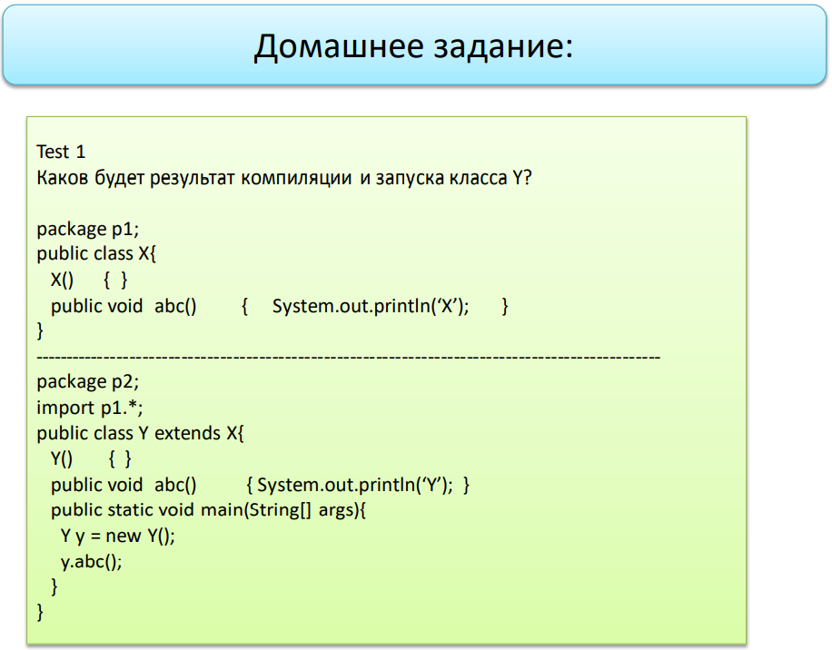
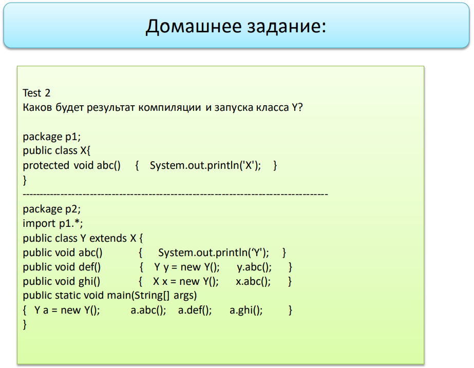
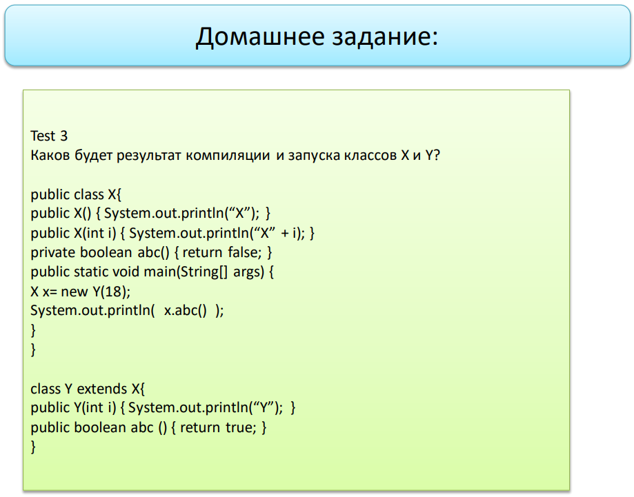
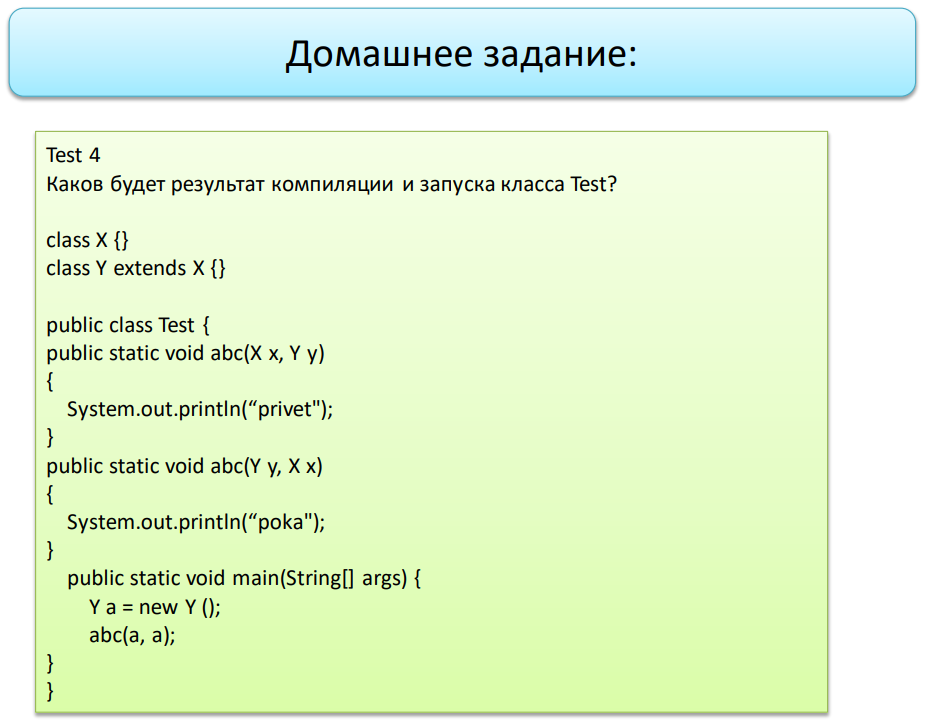
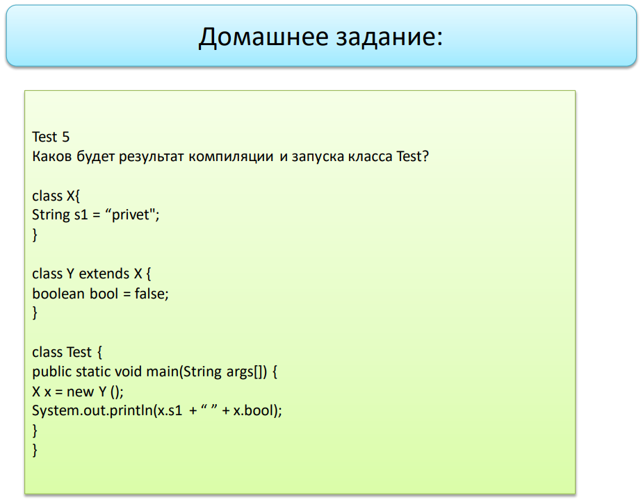

---

Моё решение:  
`Y`  

Решение преподавателя:   
`compile error`   
Конструктор класса X имеет default access modifier, и не будет виден в другом package.
Следовательно, объект класса Y не сможет обратиться к конструктору родительского класса, и не будет создан.

---

---

Моё решение:   
`Y`  
`Y`  
`Y`

Решение преподавателя:   
`compile error`   
Так как метод abc() у класса X имеет protected access modifier, то при создании экземпляра класса через sub-класс
(X x = new Y()) мы не сможем получить доступ к нему, компилятор его не увидит.

---

---

Моё решение:   
`X18`  
`Y`  
`true`  

Решение преподавателя:   
`X`  
`Y`  
`false`

---

---

Моё решение:   
`compile error`   

Решение преподавателя:   
Моё решение верно! Компилятор не сможет определить, какой именно из методов abc() следует выполнить.

---

---

Моё решение:   
`privetfalse`

Решение преподавателя:   
`compile error`   
Так как экземпляр класса X создаётся через sub-класс (X x = new Y()), то у этого класса не будет поля bool.

---
Итого: 1 из 5 правильных ответов. Ещё раз подтверждён тот факт, что я не умею решать задачи на наследование :confused: