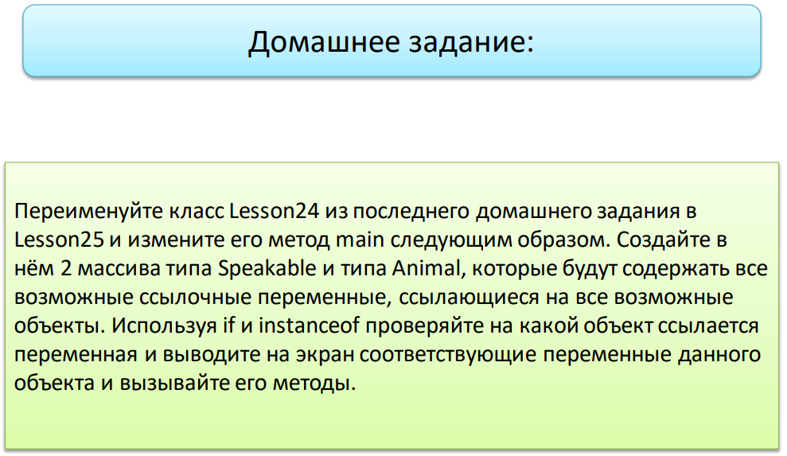

---
Чтобы не копировать все классы из предыдущего домашнего задания, я изменила в них модификаторы доступа.
Таким образом, появилась возможность их использовать при выполнении текущего домашнего задания. 