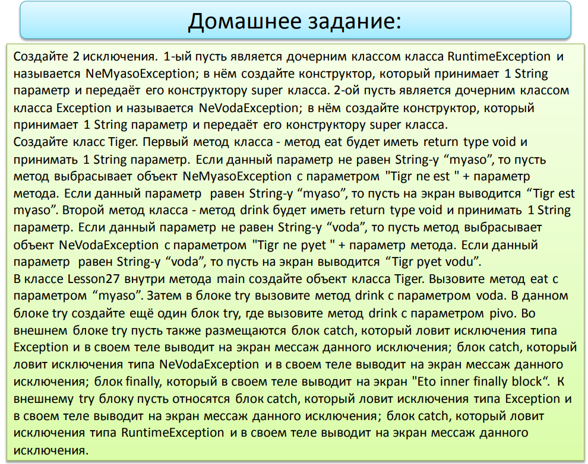
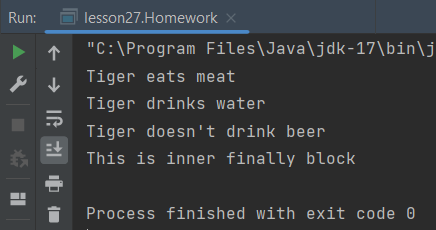

---
Все наименования я перевела на английский, латиницей по-русски писать рука не поднялась.   
К тому же, `IntelliJ IDEA` не понимает такого языка и "ругается" на опечатки :slightly_smiling_face:

