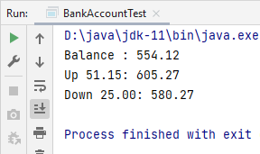

---
В первом задании не требовалось ничего выводить на экран, а только отредактировать класс, который мы создавали на уроке.  
Во втором задании вывод остался таким же, как в домашнем задании к 4 уроку.  
Поэтому привожу картинку решения только третьего задания.

